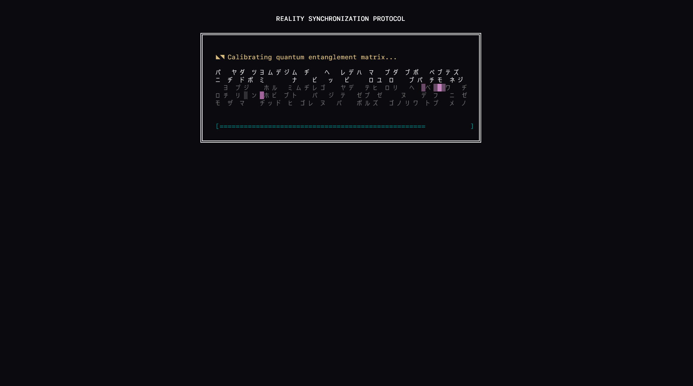
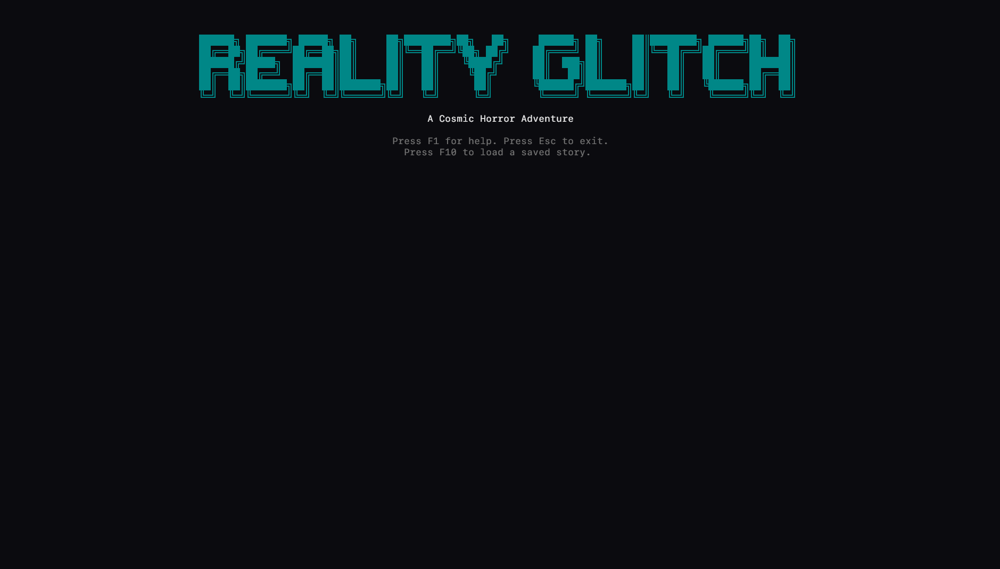
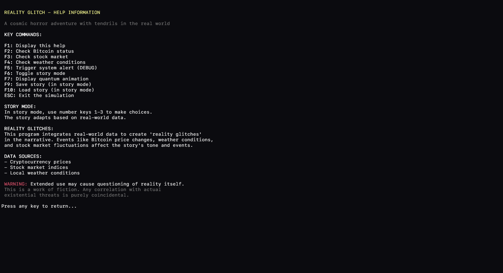
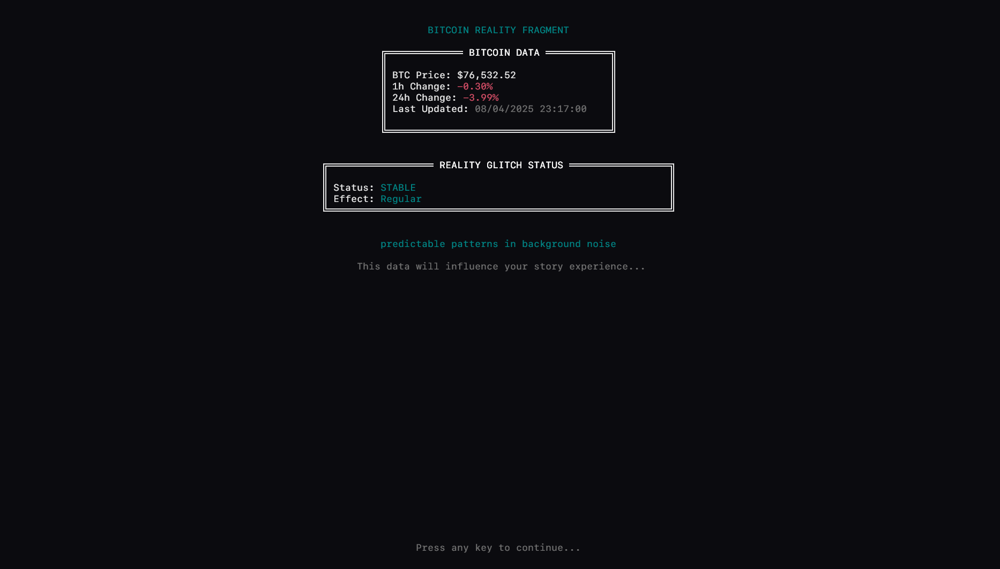
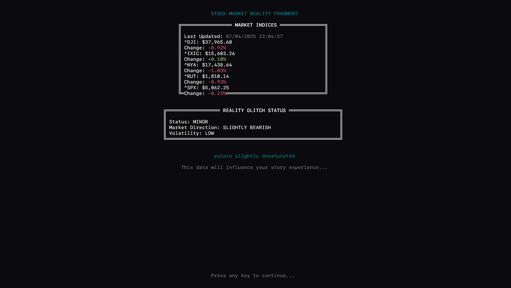
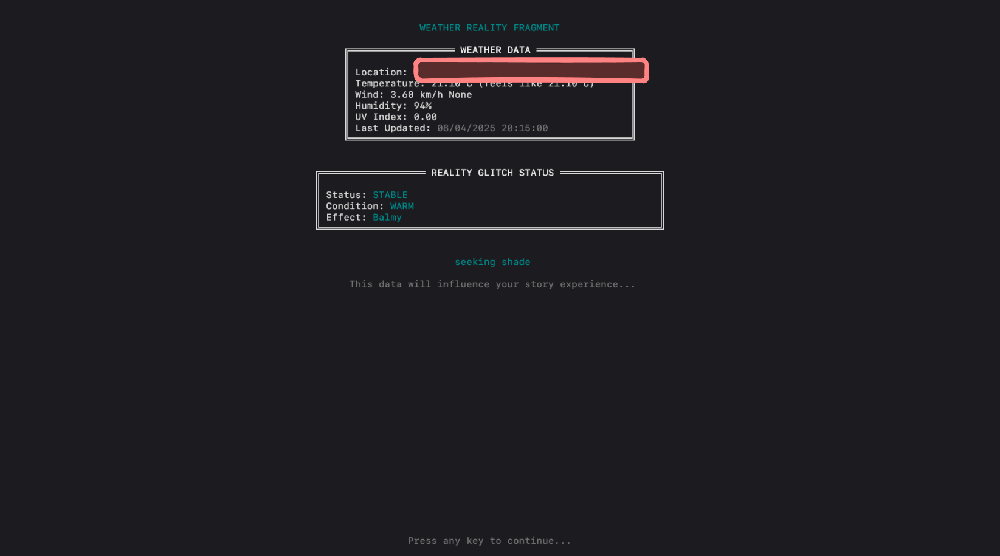

# Reality Glitch

A cosmic horror text adventure where real-world data influences your story experience through "reality glitches."

## Overview

Reality Glitch is a terminal-based text adventure that integrates real-time data from various APIs to create a dynamic and unpredictable narrative experience. The game uses real-world data to generate "reality glitches" that alter the story in subtle or dramatic ways.

## Reality Glitch Mechanic

The game's unique feature is how it integrates real-time data:

- **Bitcoin prices** (via CoinMarketCap): Influences technological and digital elements
- **Stock market indices** (via Financial Modeling Prep): Affects general atmosphere and physical laws
- **Weather data** (via Weather API): Shapes environmental descriptions

These data sources create different types of glitches that influence the narrative's tone, introduce anomalies, and modify descriptive language.

## Requirements

- Python 3.8+
- Docker and Docker Compose (for database)
- API keys for:
  - Groq API (for LLM)
  - CoinMarketCap API
  - Financial Modeling Prep API
  - Weather API

## Setup (Linux)

1. Clone the repository
2. Create a `.env` file with your API keys (example below)
3. run `./start.sh`

## Configuration

Create a `.env` file with the following structure:

```
# LLM API
GROQ_API_KEY=your_groq_api_key

# Market Data APIs
COINMARKETCAP_API_KEY=your_coinmarketcap_api_key
COINMARKETCAP_ENDPOINT=https://pro-api.coinmarketcap.com/v1/cryptocurrency/quotes/latest

FMP_API_KEY=your_fmp_api_key
FMP_ENDPOINT=https://financialmodelingprep.com/stable/batch-index-quotes

WEATHER_API_KEY=your_weather_api_key
WEATHER_ENDPOINT=http://api.weatherapi.com/v1/current.json?q=auto:ip

# Database
POSTGRES_USER=postgres
POSTGRES_PASSWORD=postgres
POSTGRES_DB=reality_glitch
POSTGRES_HOST=0.0.0.0
POSTGRES_PORT=5432
```

## Running the Game

The easiest way to start the game:

```bash
./start.sh
```

This script will:
1. Check if Docker is running
2. Create a Python virtual environment
3. Install requirements
4. Build and start Docker containers
5. Run the API scheduler in the background
6. Launch the game

For debug mode:
```bash
./start.sh --debug
```

## Controls

- **F1**: Display help
- **F2**: Check Bitcoin price
- **F3**: Check stock market
- **F4**: Check weather
- **F5**: Trigger panic event (forces multiple reality glitches)
- **F6**: Toggle story mode
- **F7**: Show animation
- **F9**: Save story (in story mode)
- **F10**: Load saved story
- **Esc**: Exit game

In story mode, use number keys 1-3 to make choices.

## Screenshots














<a href="https://groq.com" target="_blank" rel="noopener noreferrer">
  
</a>